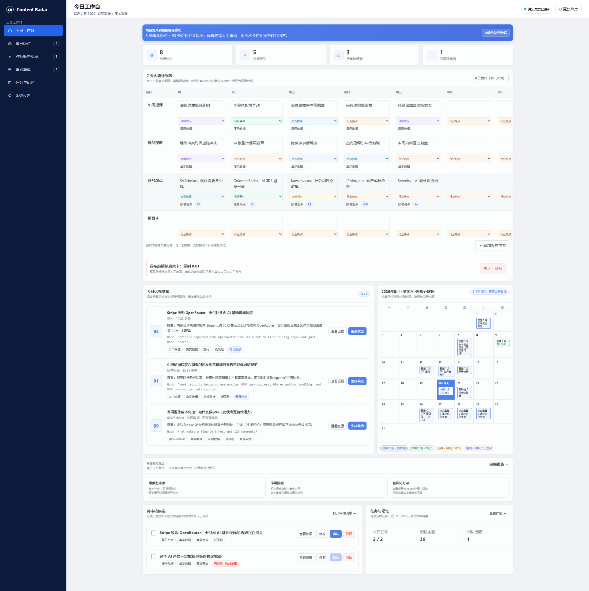
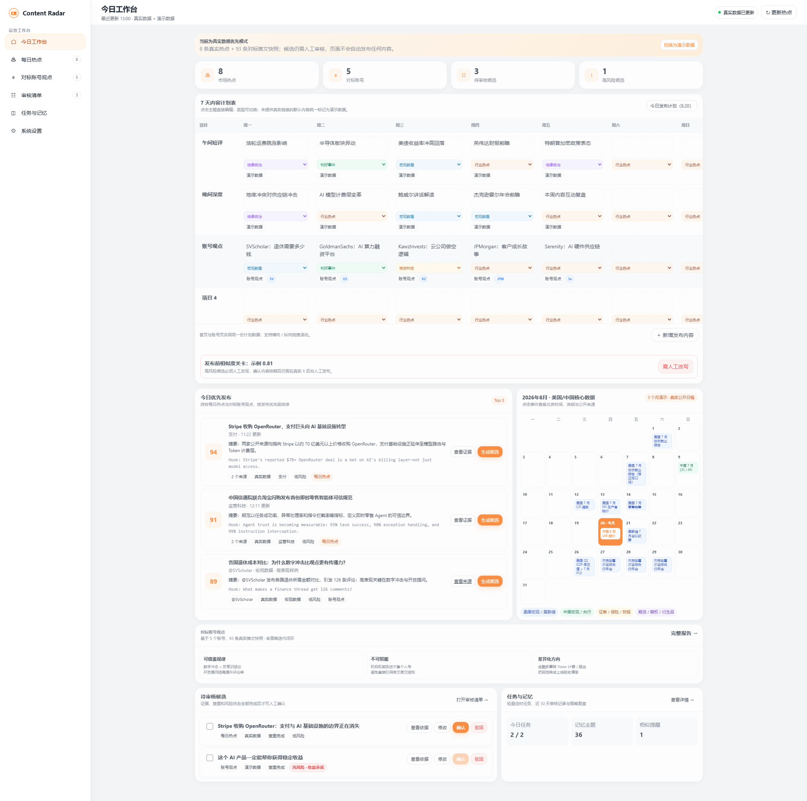

# Content Radar｜内容雷达

一个面向金融科技内容运营场景的 AI Agent 可交互 Demo，将笔试题中的“每日热点内容池”和“对标账号学习”整合为同一工作台。

## 在线体验

- Vercel：<https://content-radar-demo-xi.vercel.app>

## 当前版本

- V0.9.3
- 可编辑黑白 HTML 原型
- 桌面端与移动端响应式布局
- 静态 Demo，不会自动连接 X API 或自动发布内容

## 核心页面

- 今日工作台：7 天计划、今日优先发布、数据日历
- 每日热点：公开来源聚合、风险等级与候选生成
- 对标账号观点：账号画像、推文样例与差异化计划
- 审核清单：查看依据、修改、确认与驳回
- 任务记忆与优化：策略迭代、人工反馈闭环与近 30 天内容记忆
- 高保真预览：企业后台风格与时尚风格两个方向

## 本地运行

直接打开 `index.html` 即可；也可以使用任意静态文件服务器运行。

## 高保真方向

| 企业后台风格 | 时尚风格 |
|---|---|
|  |  |

## 数据与合规说明

页面中的公开新闻和账号样例用于产品演示；AI 生成内容必须经过人工审核。Demo 不提供个性化投资建议，不宣称已经实际接入 X API，也不会自动发布内容。
